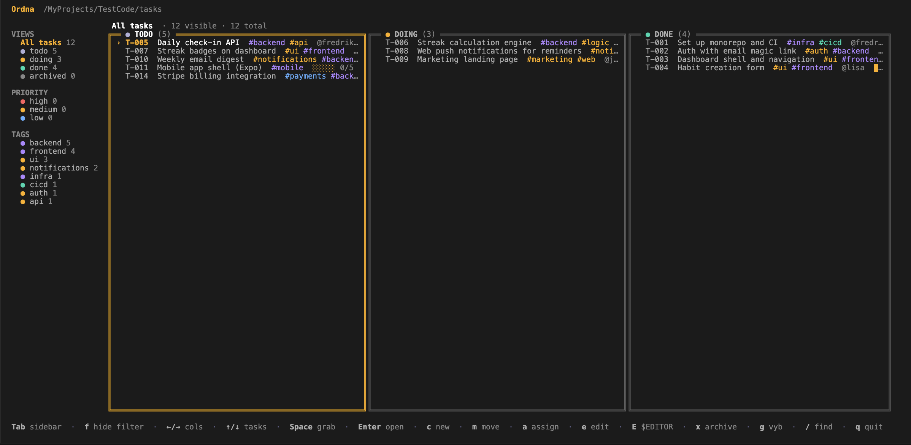
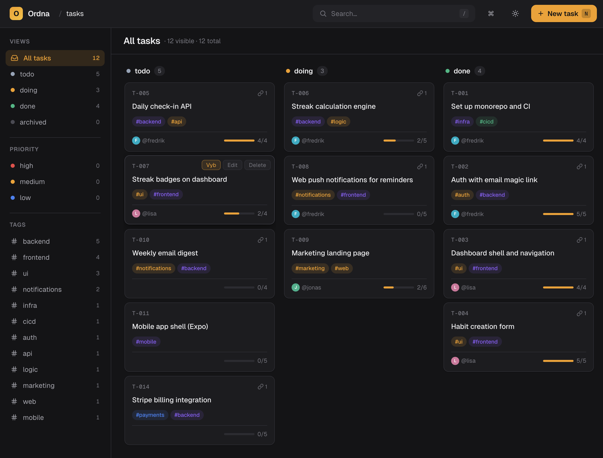

# Ordna

## A Kanban that lives inside your repo.

Ordna is a local-first, git-based task board you run from your terminal or your browser. No servers, no logins, no SaaS — just markdown files, plain commits, and an API your agents can drive.

```bash
npx @frehilm/ordna-cli ordna
```

**markdown tasks · works offline · branches as boards · TUI & Web · your data, your repo · agent-ready API**

```
tasks/
  T-001.md      # ← one file per task
  T-002.md
  T-003.md
.ordna/
  config.yaml   # ← optional
```

That's the whole schema. The CLI, TUI, and web UI all derive the board from these files.

## Built for the way you actually work

External project-management tools sit outside your code. Tasks live in a database you don't own, under an account you can't fully back up, with access that breaks when the company folds or the plan changes. And they're invisible to AI agents unless you bolt on an integration that may or may not survive the next vendor pivot.

Ordna puts tasks next to the code. One markdown file per task in `tasks/`, period. The Kanban is computed from those files. Git handles branching, merging, blame, history, and backups. Your agent opens `tasks/T-001.md` the same way it opens any other file in your repo, and writes back the same way too — no API key, no integration to maintain.

Built for the moment when half your collaborators are agents.

## What you get

- **Simple by construction.** `cat tasks/T-001.md` is the API. If your agent can read a file, your agent can read your tasks.
- **Branches are first-class.** A feature branch can have its own task edits. PRs review them like any other diff — title, description, acceptance criteria, all of it.
- **Agent-native handoff.** When the user clicks "send to agent" (or hits `g` in the TUI), Ordna POSTs the full task as JSON to your IDE over plain HTTP. That's the entire integration surface.
- **Three surfaces, one source of truth.** A polished TUI, a browser Kanban, or just the library. Pick whichever — they all read the same markdown.
- **Backlog.md compatible.** Open existing [Backlog.md](https://github.com/MrLesk/Backlog.md) repos out of the box.

## TUI

 

## Web



## Quick start

```bash
pnpm install
pnpm -r build
alias ordna="node $PWD/packages/cli/dist/bin/ordna.js"

cd your-project
ordna init                                       # creates tasks/ and .ordna/config.yaml
ordna create "Implement payment flow" -p high
ordna create "Write tests" -d T-001              # depends on T-001
ordna                                            # opens the TUI
ordna web                                        # opens the browser Kanban
```

You now have:

```
tasks/T-001.md
tasks/T-002.md
.ordna/config.yaml
```

Each is a regular markdown file. Edit them in `$EDITOR` and the board updates live.

On first run, Ordna auto-detects which **storage mode** fits your project (existing files vs existing git refs vs neither). The default is `file` — see [Storage modes](#storage-modes) below for the alternatives and when to pick them.

## Packages

| Package | What it is | Install |
|---|---|---|
| [`@frehilm/ordna-core`](packages/core/README.md) | The data layer — pure TypeScript, no UI | `pnpm add @frehilm/ordna-core` |
| [`@frehilm/ordna-cli`](packages/cli/README.md)   | The `ordna` binary + Ink-based Kanban TUI | `npm i -g @frehilm/ordna-cli` |
| [`@frehilm/ordna-web`](packages/web/README.md)   | Hono server + React SPA — the browser Kanban | `pnpm add @frehilm/ordna-web` |

The two UI packages **re-export the full core API**. So if you want both data access and a UI, you only ever install one Ordna package.

## Storage modes

Ordna ships three storage backends. Pick one per project — it changes
where tasks live on disk and how they sync. `file` is the default and the
right answer for most workflows; the other two are opt-in for specific
constraints.

| | **`file`** (default) | **`hybrid`** | **`namespace`** |
|---|---|---|---|
| Where tasks live | `tasks/*.md` files | `tasks/*.md` files + a git ref (`refs/ordna/state`) | Git refs (`refs/ordna/tasks/<id>`), one per task, pointing at blobs |
| Working tree | Tasks visible as files | Tasks visible as files | Untouched — no `tasks/` dir |
| Requires git | No | Yes | Yes |
| Multi-machine sync | Regular `git push` / `pull` | Same + synced ID allocator | Automatic push per write; fetch on 60s timer (configurable) or manual |
| Safe IDs across offline writers | No (collisions possible) | Yes (CAS on state ref) | Yes (CAS per-task ref) |
| Per-task history | `git log tasks/T-001.md` | Same as file (+ state-ref audit log) | None — refs point at blobs, no commit chain |
| `cat tasks/T-001.md` works | Yes | Yes | No — use `ordna show T-001` |
| Agents read files directly | Yes | Yes | No — via `ordna` CLI only |
| Task edits show in PRs | Yes (regular file diff) | Yes (regular file diff) | No — refs aren't in the branch tree |
| `ordna commit` | Stages `tasks/` + commits | Stages `tasks/` + commits | No-op (nothing to stage) |
| `schema: backlog` supported | Yes | No | No |

### `file` (default)

Tasks are plain markdown files in `tasks/`. The Kanban is computed from
the files. This is the "files are the API" mode — anything that can read
a file can read a task: `cat`, `grep`, your IDE, a coding agent. Commits
are explicit, so task edits ride along in PRs like any other diff.

**Pick this when:** solo or small team, agents involved, or you want PR
review of task changes. This is the documented default and matches the
bundled `AGENTS.md` verbatim.

**Watch out for:** ID collisions across offline writers. Two collaborators
creating a task at the same time on different machines will both pick the
next sequential ID; the merge-second one renumbers manually.

### `hybrid`

Same on-disk layout as `file` — tasks are still markdown files in
`tasks/` — but a git ref `refs/ordna/state` holds a synced next-id
allocator and audit log. Reads and edits look identical to `file` mode;
the difference is that `create` does a compare-and-swap on the state ref
to claim the next ID, so two offline writers can't both pick `T-042`.

**Pick this when:** you want file-mode ergonomics but multi-machine
collaboration is real and ID collisions have bitten you.

**Watch out for:** requires a git repo. `schema: backlog` is not
supported. Task file content still syncs via regular `git pull`; only the
state ref auto-fetches (on CAS conflict during a write).

### `namespace`

Tasks live as git **blobs** under `refs/ordna/tasks/<id>` — one ref per
task, no working-tree files. `git status` stays clean. `git log` on
branches doesn't see task mutations. Sync is automatic: every
create/update/delete schedules a push of `+refs/ordna/tasks/*:refs/ordna/tasks/*`.
Pulling other people's updates is via an auto-fetch timer (default 60s,
configurable) plus a manual fetch — button in the web header, `r` in the
TUI.

**Pick this when:** you need the working tree pristine. E.g. the repo
ships as a published library and you don't want `tasks/` in the package,
or you want strict separation between "task state" and "code state."

**Watch out for:**

- Standard `git clone` does **not** pull task refs. Teammates must run
  `git fetch origin '+refs/ordna/tasks/*:refs/ordna/tasks/*'` once after
  cloning, or add the refspec to `.git/config`.
- No PR review of task changes — refs aren't in the branch tree.
- No `git blame` per task — there's no commit chain, only the current
  blob is reachable through the ref.
- Direct file tools (`cat`, IDE search, agents reading files) can't see
  tasks. Everything goes through the `ordna` CLI.
- `schema: backlog` is not supported.

### Auto-detection

With no `.ordna/config.yaml`, Ordna inspects the project on first run
and picks a mode:

1. `refs/ordna/tasks/*` exist → `namespace`
2. `refs/ordna/state` exists → `hybrid`
3. `tasks/*.md` exist → `file`
4. cwd is a git repo, none of the above → prompts (TUI modal, web setup
   page, CLI `1/2/3` on a TTY)
5. else (not a git repo, no signals) → silently uses `file`

Confident detections (1–3) write `.ordna/config.yaml` so the choice is
durable across runs and visible to anyone reading the repo. Branch (4) is
interactive — the CLI exits with a hint when stdin isn't a TTY, so CI is
predictable.

### Configuration

```yaml
# .ordna/config.yaml
storage: file        # or "hybrid" or "namespace"

# Namespace-mode tuning — ignored in file/hybrid:
namespace:
  pollIntervalMs: 1000        # how often the watcher checks for ref changes
  autoFetchIntervalMs: 60000  # background fetch from origin (0 disables)
```

### `ORDNA_STORAGE` env var

`ORDNA_STORAGE=file|hybrid|namespace` overrides both
`.ordna/config.yaml` and auto-detection for a single process. Runtime
only — never written to disk. Use it for CI (predictable mode, no
on-disk side effects) and for tests pinning a specific mode against
arbitrary directories.

## Agent skill (AGENTS.md)

Ordna ships a vendor-neutral [`AGENTS.md`](packages/cli/templates/AGENTS.md)
describing the task file format, `.ordna/config.yaml`, and the `ordna` CLI.
Drop it into any project and most coding agents (Claude, Cursor, Copilot,
Codex, …) will pick it up automatically.

Two ways to install:

```bash
# 1) Via the CLI (uses the bundled template)
ordna skill install                              # writes ./AGENTS.md
ordna skill install --out docs/AGENTS.md         # custom path
ordna skill install --force                      # overwrite existing

# 2) Direct fetch — give the agent a URL, no Ordna install required
curl -fsSL https://raw.githubusercontent.com/FreHilm/ordna/main/packages/cli/templates/AGENTS.md \
  -o AGENTS.md

# Or via the CLI's --from flag
ordna skill install --from https://raw.githubusercontent.com/FreHilm/ordna/main/packages/cli/templates/AGENTS.md
```

### Workflow skill recipes

The bundled `AGENTS.md` is intentionally scoped to file format + config + CLI. Richer agent workflows — multi-step task planning, dual-reviewer pipelines, umbrella-repo orchestration — live as opt-in community recipes under [`docs/skills/`](docs/skills/). Install one with `ordna skill install --from <raw-url> --out <path>`. See the [skills README](docs/skills/README.md) for the current list.

## Host integration (IDE / Electron / agent runners)

Ordna is built to be embedded. Both UIs detect a single environment variable (or programmatic option) and surface a button that POSTs the full task to your host process — your IDE then runs an agent on it.

### Embedding

| You want                  | Install                                          | Single import covers                              |
|---------------------------|--------------------------------------------------|---------------------------------------------------|
| Just the data layer       | `@frehilm/ordna-core`                            | parser, store, watcher, git, types                |
| Embed the web kanban      | `@frehilm/ordna-web`                             | core API + `runWeb()`                             |
| Embed the TUI             | `@frehilm/ordna-cli`                             | core API + `runBoard()`                           |
| Both UIs                  | `@frehilm/ordna-web` + `@frehilm/ordna-cli`      | both UIs; pnpm dedupes the shared core            |
| Standalone CLI binary     | `npm i -g @frehilm/ordna-cli`                    | `ordna` on `$PATH`                                |

```ts
// Electron main process
import { runWeb, listTasks, watchTasks } from "@frehilm/ordna-web";
import { app, BrowserWindow } from "electron";

const ide = await runWeb({
  cwd: workspaceRoot,
  port: 0,
  openBrowser: false,
  agentHook: {
    url: `http://127.0.0.1:${ideHookPort}/agent`,
    label: "Claude",
    headers: { "X-IDE-Token": ideToken },
  },
});

new BrowserWindow().loadURL(`http://127.0.0.1:${ide.port}`);
app.on("before-quit", () => ide.close());
```

For a TUI pane, spawn the `ordna` binary inside `node-pty` and pipe to `xterm.js`. Or import `runBoard` from `@frehilm/ordna-cli` for an in-process launch.

### Agent hook

When the host is configured, both UIs show a button (web cards + modal head, TUI shortcut `g`) that POSTs to your URL:

```json
{
  "action": "agent",
  "task": { /* full Task — see core README */ },
  "context": { "tasksDir": "tasks", "cwd": "/path/to/repo", "schema": "ordna" }
}
```

The hook is **strictly opt-in**. With no env var and no programmatic option, the button doesn't appear and standalone behavior is unchanged.

For terminal users, set env vars:

```bash
export ORDNA_AGENT_HOOK_URL=http://127.0.0.1:9999/agent
export ORDNA_AGENT_HOOK_LABEL=Claude                         # default "Agent"
export ORDNA_AGENT_HOOK_HEADERS='{"X-Agent-Token":"..."}'
```

For embedded hosts, pass `agentHook` to `runWeb` / `runBoard`. The programmatic option wins; pass `agentHook: null` to disable explicitly.

Minimal listener (Node):

```ts
http.createServer((req, res) => {
  if (req.url === "/agent" && req.method === "POST") {
    let body = "";
    req.on("data", (c) => body += c);
    req.on("end", () => {
      const { task, context } = JSON.parse(body);
      runAgent(task, context);   // your code
      res.writeHead(202).end();
    });
  }
}).listen(9999, "127.0.0.1");
```

## Architecture

```
Filesystem (Git repo)
    ↓
@frehilm/ordna-core      pure library — parser, writer, store, watcher, ids, git, config
    ↓                ↙           ↘
@frehilm/ordna-cli            @frehilm/ordna-web
  (CLI + TUI)                (Hono server + React SPA)
```

- **core** has zero I/O frameworks and zero globals.
- **cli** uses commander + Ink. The TUI is a React tree rendered to the terminal.
- **web** is a Hono server serving a Vite + React SPA; drag-and-drop via `@dnd-kit`; live updates via WebSocket sourced from the core watcher.

## Principles

- **Files are the API.** If it can't be expressed in a markdown file, it doesn't belong.
- **No hidden state.** Everything you see comes from a file on disk.
- **Git is the source of truth.** Branches, merges, and blame are how you reason about task history.
- **Commits are explicit.** Ordna never auto-commits. Use `ordna commit` or plain `git commit`.
- **Zero-config defaults are load-bearing.** With no config file, behavior matches the docs. Config only expands.
- **Host integrations are opt-in.** Without env vars or options, there's nothing to see — Ordna is fully standalone.

## Development

```bash
pnpm install
pnpm -r build          # build all packages
pnpm -r test           # run all tests (core 20 · cli 8 · web 9)
pnpm --filter @frehilm/ordna-web dev:server    # server in watch mode
pnpm --filter @frehilm/ordna-web dev:client    # vite dev server on :5173
```

## License

[MIT](LICENSE) © FreHilm
